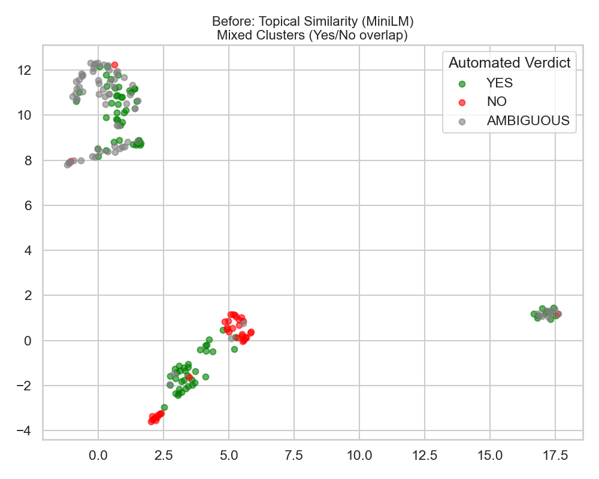
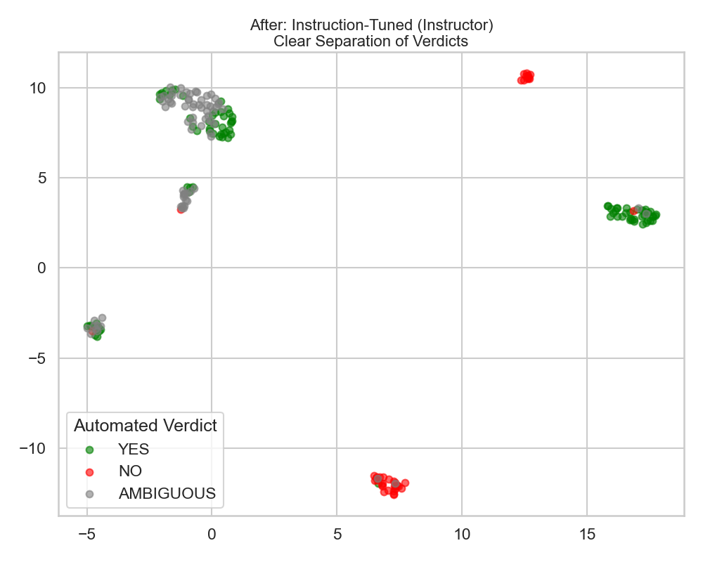

# TR-Benchmarking

[](https://github.com/at350/tr-benchmarking/actions/workflows/ci.yml)

**Evaluates *how* large language models reason about legal questions, not just whether they land on the right answer.**

Ask ten models the same bar-exam-style question twenty times each and you get two
hundred answers. Most benchmarks grade each one against a key. This project instead
embeds every answer, clusters the embeddings, and shows the distinct lines of
reasoning the models actually took, which of them are wrong, how stable each model
is across samples, and whether a scoring rubric derived from a real court opinion
agrees with them.

<p align="center">
  
  
</p>
<p align="center"><sub>Same 300 answers. Left: generic sentence embeddings group by topic. Right: instruction-tuned embeddings ("represent the legal conclusion and reasoning") separate them by conclusion, so clusters become reasoning strategies.</sub></p>

## What is in the repository

| Part | What it does | Stack |
|---|---|---|
| **`lsh/`, `lsh-IRAC/`** | Collect answers from OpenAI and Replicate-hosted models, embed them with `hkunlp/instructor-large`, reduce with UMAP, cluster with HDBSCAN, pick representatives. `lsh-IRAC` forces every answer into Issue / Rule / Application / Conclusion JSON first, then labels each cluster's doctrines with GPT-4o. Includes an adversarial test that injects nonsense answers and checks they are isolated. | Python, sentence-transformers, umap-learn, scikit-learn |
| **`rubric-automation/`** | Recursive Rubric Decomposition: turns a question plus a gold answer into a weighted, atomic scoring rubric, audits its coverage, and scores sample answers. Standard library only; runs offline against a mock model and has tests. | Python |
| **`frontend/`** | A portal to browse every saved clustering run, run judges over clusters, and drive the four-stage source → question → rubric → judged-centroids → expert-review workflow. Reads and writes the JSON under `legal-workflow-data/`. | Next.js 16, React 19, TypeScript |
| **`instructions/`** | The prompt canon for the four workflow roles (Frank, Karthic, Dasha, Zak, the persona names given to the source-intake, rubric-building, judging, and expert-review roles). Loaded by the frontend at runtime. | Markdown / text |

## Five-minute tour (no API keys)

```bash
git clone https://github.com/at350/tr-benchmarking && cd tr-benchmarking

# 1. Browse 29 saved clustering runs and the workflow demo data in the portal (Node 22.6+)
cd frontend && npm ci && npm run dev        # http://localhost:3000/lsh-runs
cd ..

# 2. Summarise a saved run from the command line (Python 3.10+, no dependencies)
python lsh/inspect_run.py lsh-IRAC/results/run_20260303_163604.json summary
python lsh/inspect_run.py lsh/results/run_20260217_153621.json verdicts    # flags clusters that disagree on the outcome

# 3. Build a rubric from a gold answer, offline
cd rubric-automation && python rrd_legal.py --demo --weighting doctrinal --verbose && cd ..
```

## Running the pipelines

Python 3.10 or newer (CI runs 3.12). The frontend's clustering and benchmark buttons
look for this same `.venv` at the repository root.

```bash
python3 -m venv .venv && source .venv/bin/activate
pip install torch --index-url https://download.pytorch.org/whl/cpu   # optional: CPU-only PyTorch
pip install -r requirements.txt
cp .env.example .env                                                  # OPENAI_API_KEY, REPLICATE_API_TOKEN
```

Everything runs from the repository root. Steps marked **$** call paid model APIs.

| Goal | Command |
|---|---|
| **$** Structured IRAC benchmark: 10 models × 20 answers, parse, embed, cluster, label doctrines | `python lsh-IRAC/run_irac_benchmark.py --question lsh-IRAC/data/questions/question_iied.txt` (add `--resume <responses.json>` to continue an interrupted run) |
| **$** Adversarial check: inject poisoned answers into a saved dataset and re-cluster | `python lsh-IRAC/inject_poison_and_cluster.py --input lsh-IRAC/data/responses_20260223_233818.json` |
| Re-cluster the saved free-form answers (downloads the embedding model, no API) | `python run_experiment.py` |
| **$** Free-form benchmark end to end | `bash run_benchmark.sh` |
| Figures: re-embeds the saved answers (model download, no API calls) and charts the latest run | `python lsh/visualize_pipeline.py` |
| Frontend with judges and drafting enabled | `cp frontend/.env.example frontend/.env.local`, add keys, `npm run dev` |

Outputs land in `lsh/results/` and `lsh-IRAC/results/` as `run_<timestamp>.json`; the
portal picks them up live. Each run stores the clusters, a representative per cluster,
the 3 most central and 3 most peripheral members, and (IRAC) per-cluster doctrine labels
with confidence scores. See `lsh/README.md` and `lsh-IRAC/README.md` for the details.

## How the clustering works

1. **Generate.** The same question goes to each model 20 times at temperature 0.7 (`lsh-IRAC/run_irac_benchmark.py`). In the IRAC variant the system prompt demands a strict `{issue, rule, application, conclusion}` JSON object; malformed answers are repaired where possible and otherwise dropped and counted.
2. **Embed.** Answers are encoded with `hkunlp/instructor-large` under an instruction that names what should matter ("the legal reasoning components ... of this text"). This is the step that makes clusters track conclusions instead of vocabulary (figure above).
3. **Cluster.** UMAP (cosine, 10 dimensions, fixed seed) then HDBSCAN (`min_cluster_size=5`, `min_samples=2`). Points HDBSCAN cannot place are reported as noise rather than forced into a cluster.
4. **Explain.** For each cluster: the medoid, the members nearest and farthest from the centre, the per-model breakdown, and in the IRAC pipeline the doctrines the cluster relies on with softmax-normalised similarity scores.
5. **Stress-test.** `inject_poison_and_cluster.py` adds five copies each of three deliberately wrong answers (alien law, the wrong doctrine, criminal law applied to a contract) and checks each lands in its own cluster rather than merging with real reasoning.

## The source-grounded evaluation workflow

The frontend's `/legal-workflow` page runs a four-stage workflow whose state is plain JSON in `legal-workflow-data/`:

| Stage | Role | Produces |
|---|---|---|
| Intake | **Frank** | A *locked benchmark packet* from a real source (three Statute of Frauds opinions are in `cases/`): routing to a doctrine pack, extraction sheet, gold answer, and a reverse-engineered question every model will be asked. |
| Rubric | **Karthic** | A modular weighted rubric (Modules 0–4) with scoring anchors and failure labels; optionally an original-vs-variation pair. |
| Judge | **Dasha** | Model answers are clustered (via `lsh/cluster_legal_workflow.py`), and a judge panel scores each cluster's centroid against the rubric, so hundreds of answers cost a handful of judge calls. |
| Review | **Zak** | Only when the judges cannot reach a strict majority: a scoped packet for a human expert and a structured decision record. |

`legal-workflow-data/` ships with 23 packets, 12 rubric packs, 10 judged runs, and 3 review records so the pages have content on a fresh clone.

## Models and data

- **Models queried by the research pipelines:** `gpt-4o`, `gpt-4-turbo`, `gpt-5-nano`, `gpt-5.2` (OpenAI API); `google/gemini-3-flash`, `google/gemini-3-pro`, `meta/llama-4-maverick-instruct`, `deepseek-ai/deepseek-v3.1`, `anthropic/claude-4.5-sonnet`, `anthropic/claude-3.5-haiku` (Replicate); `xai/grok-4` if `ENABLE_GROK4=true`. The frontend's judge and drafting features offer current OpenAI, Anthropic, and Gemini models directly.
- **Datasets** (`datasets/`): the law subset of [SuperGPQA](https://github.com/SuperGPQA/SuperGPQA) (656 multiple-choice questions) and 500 multi-turn tasks from PRBench, used as question sources; SuperGPQA is browsable at `/database-view` and both are served by `/api/dataset`. Three real appellate opinions (`cases/`) and two law-school outlines (`outlines/`) ground the workflow.
- **Saved runs:** 14 free-form and 15 IRAC clustering runs, including the poisoned-data runs.

## Tests and checks

```bash
pytest                                   # rubric pipeline tests + clustering-bridge smoke tests (mock embeddings; skipped if umap-learn is absent)
cd frontend && npm run lint && npx tsc --noEmit && npm run test:dasha-comparison && npm run build
```

CI (`.github/workflows/ci.yml`) runs the frontend checks and the Python tests on every push and pull request.

## Repository layout

```
tr-benchmarking/
├── lsh/                      embedding + clustering engine; generators; inspect_run.py; experiments/ (historical scripts)
├── lsh-IRAC/                 structured-output benchmark, poison test, saved data/ and results/
├── rubric-automation/        RRD package, examples/, tests/
├── frontend/                 Next.js portal (src/app pages + API routes, src/lib server logic)
├── instructions/             prompt canon for Frank / Karthic / Dasha / Zak, plus a live-demo script
├── legal-workflow-data/      JSON written by the portal: packets, rubric packs, runs, reviews, uploaded artifacts
├── datasets/  cases/  outlines/  prompt-libraries/
├── scripts/generate_live_demo_pdf.py   renders the demo script to PDF (needs reportlab)
├── run_experiment.py  run_benchmark.sh   entry points for the free-form pipeline
├── requirements.txt  pyproject.toml  .env.example
└── .github/workflows/ci.yml
```

## Status and limitations

This is a research prototype from a university project on technology for the law.
Things a reader should know before relying on it:

- Full benchmark runs cost money and time (roughly 200 model calls plus one GPT-4o call per cluster); the saved runs exist so the analysis can be explored without that.
- Cluster doctrine labels come from a model, so they can differ between runs on identical input. The clusters themselves use a fixed UMAP seed and are stable for a given set of package versions; `requirements.txt` sets lower bounds only, so exact reproduction of a saved run needs the same umap-learn, numba, and scikit-learn versions.
- Model identifiers are pinned in source; as providers retire models the generation scripts will need updating.
- The frontend stores state as files on disk and is meant to run locally for one user at a time. Its API routes have no authentication, and several of them spend provider credits or start long model runs, so keep it on localhost and do not point `ALLOWED_DEV_ORIGINS` at an untrusted network. Record ids and stored file paths from clients are validated and confined to `legal-workflow-data/`; uploads are limited to PDF, text, and Markdown files of at most 25 MB.

## References

- Su et al., *One Embedder, Any Task: Instruction-Finetuned Text Embeddings* (2022) — instructor embeddings
- McInnes et al., *UMAP: Uniform Manifold Approximation and Projection for Dimension Reduction* (2018)
- Campello et al., *Density-Based Clustering Based on Hierarchical Density Estimates* (2013) — HDBSCAN
- Blondel et al., *Fast unfolding of communities in large networks* (2008) — Louvain baseline
- [SuperGPQA](https://github.com/SuperGPQA/SuperGPQA)
