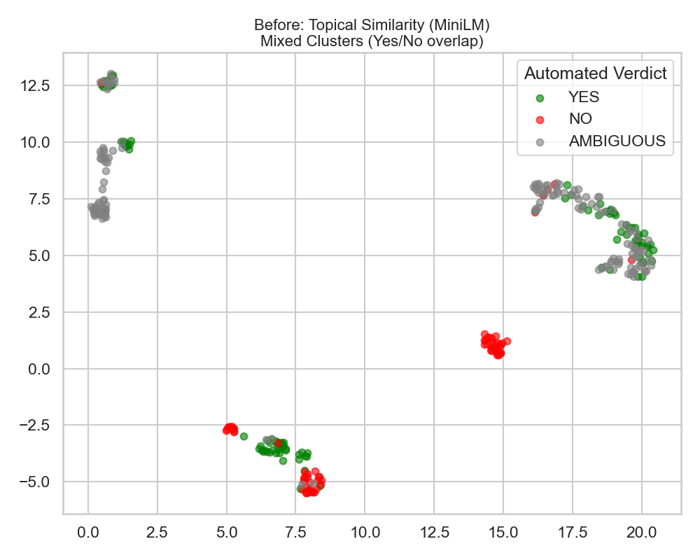
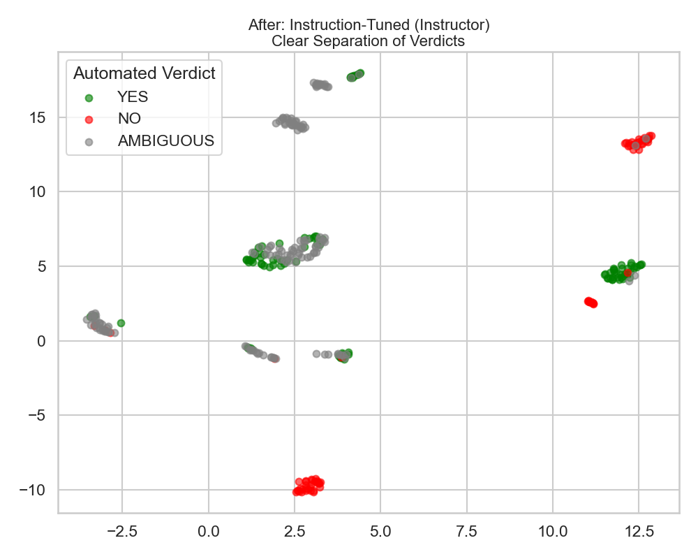

# TR-Benchmarking

[](https://github.com/at350/tr-benchmarking/actions/workflows/ci.yml)
[](LICENSE)


**A toolkit for seeing *how* language models reason about legal questions, not just whether they land on the right answer.**

Ask ten models the same bar-exam-style question twenty times each and you get two
hundred answers. Most benchmarks grade each one against a key. `trbench` instead embeds
every answer, clusters the embeddings, and shows the distinct lines of reasoning the
models actually took: which of them are wrong, how stable each model is across samples,
and whether a scoring rubric derived from a real court opinion agrees with them.

<p align="center">
  
  
</p>
<p align="center"><sub>Same 318 answers (314 unique ids) to one Statute of Frauds question. Left: generic sentence embeddings group by topic. Right: instruction-tuned embeddings ("represent the legal conclusion and reasoning") separate them by conclusion. Colours are an automated keyword verdict, not human labels.</sub></p>

## What is in the repository

| Part | What it does |
|---|---|
| **`trbench/`** (Python package, `pip install -e .`) | Collect answers from OpenAI and Replicate-hosted models, embed them with `hkunlp/instructor-large`, reduce with UMAP, cluster with HDBSCAN, and write a run file with representatives, central and peripheral members, and (for IRAC answers) GPT-4o doctrine labels. One command, `trbench`, with a subcommand per task, including an adversarial test that injects nonsense answers and checks they are isolated. |
| **`runs/`** | 29 saved clustering runs and the model answers behind them, for the free-form and IRAC pipelines. |
| **`rubric-automation/`** | Recursive Rubric Decomposition: turns a question plus a gold answer into a weighted, atomic scoring rubric, audits its coverage, and scores sample answers. Standard library only, runs offline against a mock model, tested. |
| **`frontend/`** (Next.js 16, React 19) | A portal to browse every saved run, run judges over clusters, and drive the four-stage source → question → rubric → judged-centroids → expert-review workflow. Reads and writes the JSON under `legal-workflow-data/`. |
| **`instructions/`** | The prompt canon for the four workflow roles (Frank, Karthic, Dasha, Zak: the persona names given to the source-intake, rubric-building, judging, and expert-review roles). Loaded by the portal at runtime. |

## Install

```bash
git clone https://github.com/at350/tr-benchmarking && cd tr-benchmarking
python3 -m venv .venv && source .venv/bin/activate
pip install torch --index-url https://download.pytorch.org/whl/cpu   # optional: CPU-only PyTorch, much smaller
pip install -e ".[all]"          # or plain `pip install -e .` without the figure and PDF extras
trbench --help
```

Python 3.10 or newer. The portal needs Node 22.6 or newer: `cd frontend && npm ci`.
Commands that call model APIs read `OPENAI_API_KEY` and `REPLICATE_API_TOKEN` from the
environment or a `.env` file (`cp .env.example .env`).

## Five-minute tour (no API keys)

```bash
# Summarise a saved run: which models fall in which cluster, and whether a cluster disagrees with itself
trbench inspect runs/irac/results/run_20260303_163604.json summary
trbench inspect runs/free-form/results/run_20260217_153621.json verdicts

# Re-cluster the saved free-form answers into a scratch folder (downloads the 1.3 GB embedding
# model on first use, a few minutes on a CPU, no API calls); drop --results-dir to add the run to runs/
trbench cluster --results-dir /tmp/trbench-runs

# Build a rubric from a gold answer, offline
cd rubric-automation && python rrd_legal.py --demo --weighting doctrinal --verbose && cd ..

# Browse every run and the workflow demo data in the portal
cd frontend && npm run dev        # http://localhost:3000/lsh-runs
```

## Run it on your own question

```bash
echo "Your legal question here." > my_question.txt

# See the request plan first: models, count, cost in requests. No API calls.
trbench irac-benchmark --question my_question.txt --per-model 10 --dry-run

# Then run it: 10 answers per model, parsed into IRAC, clustered, doctrines labelled.
trbench irac-benchmark --question my_question.txt --per-model 10
trbench inspect runs/irac/results/run_<timestamp>.json summary

# Add deliberately wrong answers to that dataset and check they are isolated.
trbench poison --input runs/irac/responses/responses_<timestamp>.json
```

Restrict the models with `--openai-models` / `--replicate-models` (comma-separated), resume an
interrupted run with `--resume`, and point `--output-dir` elsewhere to keep experiments apart.
A full run is about 200 model calls and takes tens of minutes, most of it waiting on the
providers; without any key the benchmark commands print the plan and exit without writing.
The portal lists every `run_<timestamp>.json` under `runs/free-form/results/` and
`runs/irac/results/` and refreshes when one appears; runs written to another `--output-dir`
are not shown. The three built-in poisons were written for the saved farmland question, so on
your own question they are off-topic rather than doctrinally wrong answers (see
[docs/clustering.md](docs/clustering.md)).

## Commands

| Command | What it does | Calls paid APIs |
|---|---|---|
| `trbench cluster` | Embed and cluster a saved free-form responses file (`--method lsh` for the LSH + Louvain baseline) | no |
| `trbench inspect <run> {summary,small,verdicts,excerpts}` | Summarise a run file | no |
| `trbench generate --provider {openai,replicate}` | Collect free-form answers to a question, appending to a responses file | yes |
| `trbench robust-benchmark` | Free-form answers from every model for one question, then cluster | yes |
| `trbench irac-benchmark --question FILE` | IRAC-structured answers from every model, cluster, label doctrines | yes |
| `trbench poison` | Inject wrong answers into a saved IRAC dataset and re-cluster | labels only |
| `trbench visualize` | The two embedding maps and the cluster-size chart (needs the `viz` extra) | no |
| `trbench grid-search` | Sweep UMAP/HDBSCAN settings against the verdict heuristic | no |
| `trbench bridge --input FILE` | JSON-in / JSON-out clustering used by the portal | no |
| `trbench replicate-check` | One small request to confirm a Replicate token works | yes |

Every command has `--help`; the benchmark commands have `--dry-run`. `LSH_MOCK_EMBEDDINGS=1`
swaps the embedding model for random vectors so the pipeline can be exercised without a download.

## How the clustering works

1. **Generate.** The same question goes to each model 20 times at temperature 0.7 (1.0 for `gpt-5-nano`). In the IRAC variant the system prompt demands a strict `{issue, rule, application, conclusion}` JSON object; malformed answers are repaired where possible and otherwise dropped and counted.
2. **Embed.** Answers are encoded with `hkunlp/instructor-large` under an instruction that names what should matter ("the legal reasoning components ... of this text"). This is the step that makes clusters track conclusions instead of vocabulary (figure above).
3. **Cluster.** UMAP (cosine, 10 dimensions, fixed seed) then HDBSCAN (`min_cluster_size=5`, `min_samples=2`). Points HDBSCAN cannot place are reported as noise rather than forced into a cluster.
4. **Explain.** For each cluster: the medoid, the members nearest and farthest from the centre, the per-model breakdown, and in the IRAC pipeline the doctrines the cluster relies on with softmax-normalised similarity scores.
5. **Stress-test.** `trbench poison` adds five copies each of three deliberately wrong answers (alien law, the wrong doctrine, criminal law applied to a contract) and reports which cluster each landed in.

Details, file formats, and reproducibility notes: [docs/clustering.md](docs/clustering.md).

## Results at a glance

Latest saved IRAC run per question (`trbench inspect <run> summary` reproduces these numbers). "Noise" is the count of answers HDBSCAN left unclustered.

| Question (abridged) | Run | Answers | Models | Clusters | Noise | Largest cluster |
|---|---|---|---|---|---|---|
| Father's oral promise to pay son's loans if he marries (Statute of Frauds, marriage) | `irac/results/run_20260303_163604` | 176 | 9 | 13 | 0 | 41 |
| Farmland deed, bounced $10,000 check, parol evidence objection | `irac/results/run_20260223_233818` | 180 | 9 | 13 | 0 | 25 |
| Same question with 15 poisoned answers injected | `irac/results/run_20260303_155256_poisoned` | 195 | 12 | 15 | 0 | 25 |
| Merchant's signed firm offer, later revocation (UCC 2-205) | `irac/results/run_20260224_005948` | 180 | 9 | 10 | 0 | 40 |
| Missing dog, posted reward, finder unaware of it | `irac/results/run_20260224_153911` | 180 | 9 | 15 | 8 | 20 |
| "If you will mow my lawn..." neighbour promise (consideration) | `irac/results/run_20260224_154905` | 179 | 9 | 13 | 1 | 21 |
| Couple shopping, injury in a department store (IIED) | `irac/results/run_20260224_003329` | 179 | 9 | 12 | 0 | 40 |

Free-form baseline on the marriage question: `free-form/results/run_20260217_153621`, 318 answers from 9 models, 13 clusters, none unclustered, largest cluster 83. The two figures at the top of this page come from that run.

## The source-grounded evaluation workflow

The portal's `/legal-workflow` page runs a four-stage workflow whose state is plain JSON in `legal-workflow-data/`:

| Stage | Role | Produces |
|---|---|---|
| Intake | **Frank** | A *locked benchmark packet* from a real source (the text of three Statute of Frauds opinions is in `cases/`): routing to a doctrine pack, extraction sheet, gold answer, and a reverse-engineered question every model will be asked. |
| Rubric | **Karthic** | A modular weighted rubric (Modules 0–4) with scoring anchors and failure labels; optionally an original-vs-variation pair. |
| Judge | **Dasha** | Model answers are clustered (through `trbench bridge`), and a judge panel scores each cluster's centroid against the rubric, so hundreds of answers cost a handful of judge calls. |
| Review | **Zak** | Only when the judges cannot reach a strict majority: a scoped packet for a human expert and a structured decision record. |

`legal-workflow-data/` ships with 22 packets, 12 rubric packs, 10 judged runs, and 3 review records so the pages have content on a fresh clone. See [frontend/README.md](frontend/README.md).

## Models and data

- **Models queried by the IRAC pipeline:** `gpt-4o`, `gpt-4-turbo`, `gpt-5-nano`, `gpt-5.2` (OpenAI API); `google/gemini-3-flash`, `google/gemini-3-pro`, `meta/llama-4-maverick-instruct`, `deepseek-ai/deepseek-v3.1`, `anthropic/claude-4.5-sonnet`, `anthropic/claude-3.5-haiku` (Replicate); `xai/grok-4` if `ENABLE_GROK4=true`. The free-form runs also sampled `gpt-3.5-turbo`, `gpt-5-mini`, `claude-3.5-sonnet`, and `llama-3-70b`. The portal's judge and drafting features offer current OpenAI, Anthropic, and Gemini models directly.
- **Data** (`datasets/`, `cases/`, `outlines/`): the law subset of [SuperGPQA](https://github.com/SuperGPQA/SuperGPQA) (656 multiple-choice questions), browsable at `/database-view`; the public-domain text of three appellate opinions that the workflow demo is built on; and an `outlines/` folder for your own law-school outline PDFs (none are redistributed). Attribution and terms: [datasets/README.md](datasets/README.md), [cases/README.md](cases/README.md).
- **Saved runs:** 14 free-form and 15 IRAC clustering runs under `runs/`, including the poisoned-data runs.

## Tests and checks

```bash
pytest                                   # parsing, provider client, run-file builder, clustering bridge (mock embeddings), rubric pipeline
cd frontend && npm run lint && npx tsc --noEmit && npm run test:dasha-comparison && npm run build
```

CI runs both on every push. See [CONTRIBUTING.md](CONTRIBUTING.md).

## Repository layout

```
tr-benchmarking/
├── trbench/                  Python package: text.py, pipeline.py, density_clustering.py, providers.py, results.py, irac/, cli/
├── runs/                     free-form/ and irac/: responses/ (model answers) and results/ (run files)
├── rubric-automation/        RRD package, examples/, tests/
├── frontend/                 Next.js portal (src/app pages and API routes, src/lib server logic)
├── instructions/             prompt canon for Frank / Karthic / Dasha / Zak, plus the live-demo script
├── legal-workflow-data/      JSON written by the portal: packets, rubric packs, runs, reviews, uploaded artifacts
├── datasets/  cases/  outlines/  prompt-libraries/   SuperGPQA subset, opinion texts, your own outline PDFs, historical prompts
├── docs/                     figures/ and clustering.md
├── experiments/              earlier benchmark scripts kept for provenance
├── tests/                    pytest suite for the package
├── scripts/generate_live_demo_pdf.py   renders the demo script to PDF (needs the pdf extra)
├── pyproject.toml  LICENSE  CITATION.cff  CONTRIBUTING.md  .env.example
└── .github/workflows/ci.yml
```

## Status and limitations

This is a research prototype from a university project on technology for the law.
Things a reader should know before relying on it:

- Full benchmark runs cost money and time (roughly 200 model calls plus one GPT-4o call per cluster); the saved runs exist so the analysis can be explored without that. Use `--dry-run` to see the plan first.
- Cluster doctrine labels come from a model, so they can differ between runs on identical input. The clusters themselves use a fixed UMAP seed and are stable for a given set of package versions; exact reproduction of a saved run needs the same umap-learn, numba, and scikit-learn versions.
- Clusters often line up with model family as much as with reasoning (in `run_20260303_163604`, one cluster is 20 of 20 `gpt-5.2` answers), so part of what is being clustered is a model's house style. Reading the representatives, not just the counts, is part of the method.
- Model identifiers are pinned in the command defaults; as providers retire models, pass your own lists.
- The portal stores state as files on disk and is meant to run locally for one user at a time. Its API routes have no authentication, and several of them spend provider credits or start long model runs, so keep it on localhost and do not point `ALLOWED_DEV_ORIGINS` at an untrusted network. Record ids and stored file paths from clients are validated and confined to `legal-workflow-data/`; uploads are limited to PDF, text, and Markdown files of at most 25 MB.

## Team and history

Built by a three-person team for a university course on technology for the law
(COMP_SCI 397/497) between February and April 2026, with AI coding assistance. From
the commit history: the portal, the instruction canon, and the workflow data were
developed mainly by DavidL0417; the IRAC benchmark and poison test by Alan Tai; the
rubric-automation package by Clark Hanlon; the shared clustering engine was joint work.
The September 2026 commits are a cleanup, hardening, and packaging pass over the whole repository.

## License and citation

Code is released under the [MIT License](LICENSE). The SuperGPQA subset under `datasets/` is
redistributed for research use under its upstream terms ([datasets/README.md](datasets/README.md));
the opinions under `cases/` are public records ([cases/README.md](cases/README.md)). If you use this work, please cite it with the metadata in
[CITATION.cff](CITATION.cff) (GitHub shows a "Cite this repository" button).

## References

- Su et al., *One Embedder, Any Task: Instruction-Finetuned Text Embeddings* (2022) — instructor embeddings
- McInnes et al., *UMAP: Uniform Manifold Approximation and Projection for Dimension Reduction* (2018)
- Campello et al., *Density-Based Clustering Based on Hierarchical Density Estimates* (2013) — HDBSCAN
- Blondel et al., *Fast unfolding of communities in large networks* (2008) — Louvain baseline
- [SuperGPQA](https://github.com/SuperGPQA/SuperGPQA)
