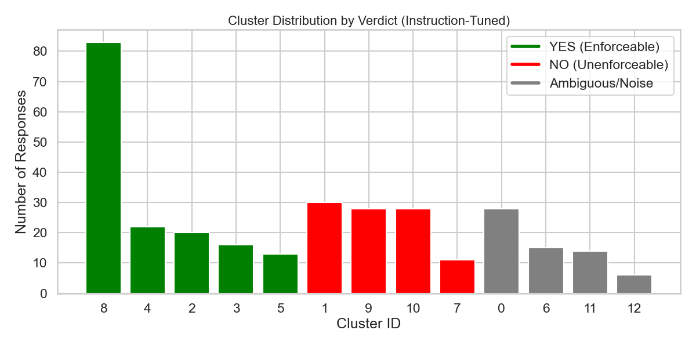

# The clustering pipelines

This page explains what `trbench` does to a set of model answers, how the two pipelines
(free-form and IRAC) differ, what the files under `runs/` contain, and what you need to
know to reproduce or extend a run.

## Idea

Ask several models the same legal question many times each. Instead of grading every
answer against a key, embed the answers and cluster them. Each cluster is a line of
reasoning the models took; its size says how common that line is, its model breakdown
says which models take it, and its representative shows what the line actually argues.
Answers no dense group claims are reported as noise rather than forced into a cluster.

## Steps

1. **Collect.** `trbench irac-benchmark` (structured) and `trbench robust-benchmark`
   (free-form) sample each model `--per-model` times at temperature 0.7 (`gpt-5-nano` at 1.0).
   `trbench generate` collects a `--count` of free-form answers spread over a model list,
   cycling the temperature 0.7 to 1.1 across OpenAI samples (1.0 for OpenAI models with "mini"
   in the name; Replicate samples all use 0.7) and
   appending to a responses file. The IRAC variant demands a strict
   `{issue, rule, application, conclusion}` JSON object; answers that cannot be parsed even
   after repair are counted as failures, not silently dropped.
2. **Embed** (`trbench.text.encode_responses`). Answers are encoded with
   `hkunlp/instructor-large` under an instruction that names what should matter:
   *"Represent the legal conclusion and reasoning of this text"* for free-form answers,
   *"Represent the legal reasoning components (Issue, Rule, Application, Conclusion) of this text"*
   for IRAC. This is the step that makes clusters track conclusions rather than vocabulary
   (see the two figures in the README).
3. **Reduce and cluster** (`trbench.density_clustering`). UMAP to 10 dimensions (cosine,
   `n_neighbors=5`, `min_dist=0.1`, fixed seed 42), then HDBSCAN (`min_cluster_size=5`,
   `min_samples=2`, excess-of-mass). Points HDBSCAN cannot place get label `-1`.
4. **Summarise** (`trbench.pipeline.LSHEvaluationPipeline`, `trbench.results`). For each
   cluster: the medoid (member closest to the mean embedding), the three most central
   members, a seeded sample of three from the outer third, and the per-model breakdown.
5. **Label** (IRAC only, `trbench.irac.pipeline`). GPT-4o names up to four doctrines each
   cluster relies on; each label is embedded and scored by softmax-normalised cosine
   similarity against the members. Labels are model output and can differ between runs.
6. **Stress-test** (`trbench poison`). Five copies each of three deliberately wrong answers
   (alien law, the wrong doctrine, criminal law applied to a contract) are added to a saved
   dataset; the command reports which cluster each poison landed in. A well-separated poison
   forms its own cluster instead of merging with real reasoning. The three poisons were written
   for the bounced-check farmland question behind the saved IRAC runs; on another question they
   are off-topic answers rather than doctrinally wrong ones, so write your own in
   `trbench/irac/poisons.py` before drawing conclusions about a new question.

The baseline that gave the original LSH module its name, random-hyperplane
locality-sensitive hashing to propose candidate pairs followed by Louvain community
detection, is kept in `trbench.lsh_index` and `trbench.graph_clustering` and runs with
`trbench cluster --method lsh`.

Provenance of the saved runs: the first five free-form runs (10 February 2026,
`run_20260210_154919` to `run_20260210_161805`) used that LSH + Louvain baseline; the later
free-form runs used UMAP to 5 dimensions; every IRAC run used 10 dimensions, which is the
current default for both pipelines.

<p align="center"></p>

## Files under `runs/`

```
runs/
├── free-form/
│   ├── responses/   responses.json (318 answers to the marriage-provision question) and other collections
│   └── results/     run_<timestamp>.json
└── irac/
    ├── questions/   one file per question behind the saved IRAC runs (see runs/README.md)
    ├── responses/   responses_<timestamp>.json, responses_poisoned_<timestamp>.json
    └── results/     run_<timestamp>.json, run_<timestamp>_poisoned.json
```

**Responses file**: a JSON list. Free-form records are
`{"id", "model", "prompt", "response": "<text>"}`; IRAC records carry
`"response": {"issue", "rule", "application", "conclusion"}` plus `"raw_text"`.
Ids are `<model>_<index>` and must be unique (duplicates are reported and the last one wins).

**Run file**: written by `trbench.results.build_results_document`, read by `trbench inspect` and
the portal's `/lsh-runs` page. This is what the current code writes (illustrative values):

```json
{
  "metadata": {
    "timestamp": "20260303_163604", "question": "...", "schema": "IRAC",
    "method": "density_umap_hdbscan",
    "params": {"umap_dims": 10, "n_neighbors": 5, "min_dist": 0.1, "min_cluster_size": 5, "min_samples": 2, "random_state": 42},
    "total_items": 200, "duplicate_ids_dropped": 0, "num_clusters": 7, "failures": {"gemini-3-pro": 3},
    "versions": {"python": "3.11.15", "umap-learn": "0.5.12", "numba": "0.67.0", "scikit-learn": "1.9.0"}
  },
  "clusters": {
    "0": {
      "representative": {"id": "gpt-4o_3", "model": "gpt-4o", "issue": "...", "rule": "...", "application": "...", "conclusion": "..."},
      "members": [...], "centroid_members": [...], "edge_members": [...],
      "topic_signals": {"Statute of Frauds": 82.4, "One-Year Rule": 14.1}
    },
    "-1": {"representative": {"id": "N/A", "model": "NOISE", ...}, "members": [...]}
  }
}
```

Clusters are ordered largest first; `"-1"` is the noise cluster. Free-form members have a
`text` field instead of the four IRAC fields. The saved runs were written by earlier versions
of the code: none has `params` or `duplicate_ids_dropped`, only the three most recent IRAC
runs have `centroid_members` and `edge_members`, four free-form runs key the noise cluster
`"noise"` instead of `"-1"`, and `failures` may use full Replicate ids. Readers (the portal,
`trbench inspect`) treat all of these as optional.

## Reproducibility

- Embeddings are deterministic for a given model file; UMAP and HDBSCAN use fixed seeds.
  Clusters are therefore stable for a given set of package versions, but `umap-learn`,
  `numba`, and `scikit-learn` releases can move points slightly. Run files written by the
  current code record the installed versions under `metadata.versions`; the saved runs predate
  this and the environment that produced them was not recorded, so expect small differences
  when re-clustering them.
- Topic labels come from a model call and are not deterministic even with the seeded sample.
- The embedding model is about 1.3 GB and is downloaded on first use; embedding 300 answers
  takes a few minutes on a laptop CPU.
- `LSH_MOCK_EMBEDDINGS=1` replaces the encoder with seeded random vectors so the commands
  and tests can run without downloading a model. Cluster counts under mock embeddings are
  meaningless as science but useful as a regression check (the test-suite relies on this).
- Model identifiers are pinned in `trbench/cli/irac_benchmark.py`, `robust_benchmark.py`,
  and `generate.py`; override them with `--openai-models` / `--replicate-models` / `--models`
  as providers retire models.

## Extending

- A new provider: add a function to `trbench/providers.py` following `replicate_predict`
  (create, poll, deadline, readable errors) and wire it into the benchmark commands.
- A new output schema: give `build_results_document` a `member_fields` callback for your
  record shape; the portal renders any record with a `text` field or the four IRAC fields.
- A different embedding model: `encode_responses(texts, model_name=..., instruction=...)`
  accepts any sentence-transformers model; instruction-tuned models receive
  `[instruction, text]` pairs.
